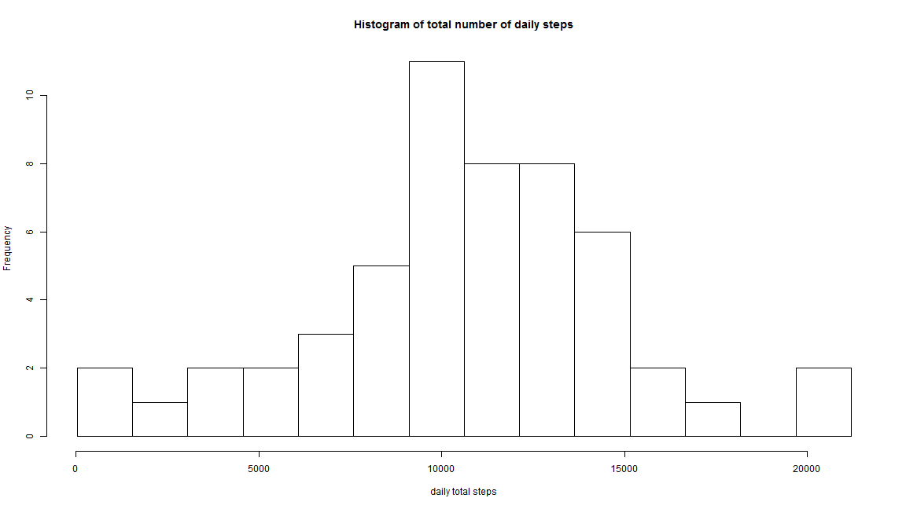
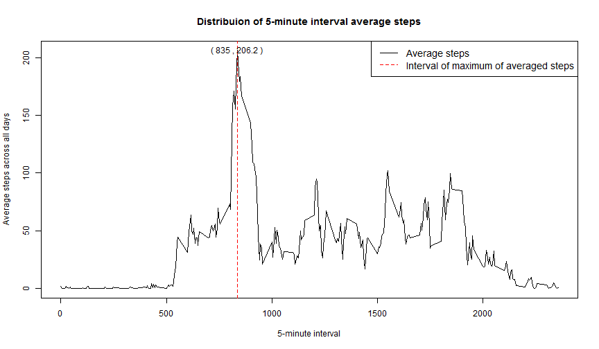
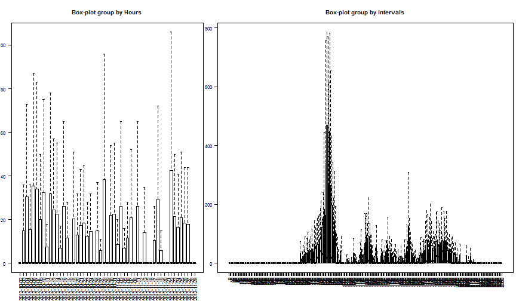
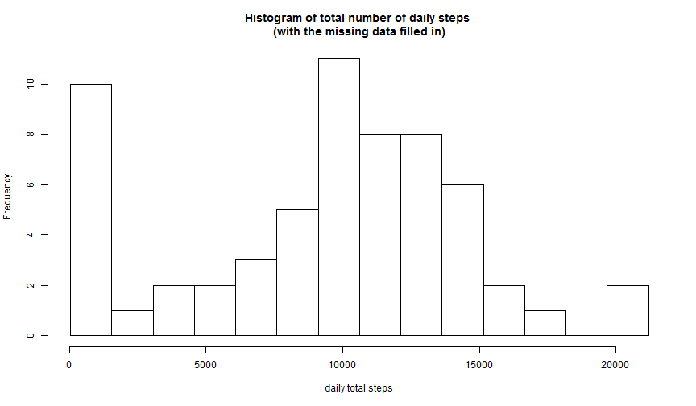
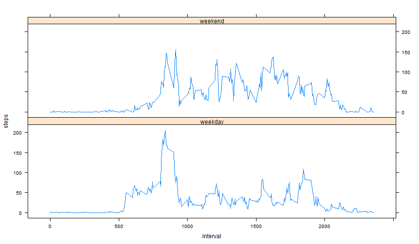

# Reproducible Research: Peer Assessment 1


## Loading and preprocessing the data

Set a work directory by `setwd` to load data and work on that. 

```r
Wdir <- "D:\\Miscellaneous\\Google~1\\eLearn\\Johns Hopkins_Data Science\\Reproducible Research\\Assignment"
setwd(Wdir)
Data.df <- read.csv("activity.csv", stringsAsFactors=F)
(dim.vt <- dim(Data.df))
```

```
## [1] 17568     3
```

```r
(summ.df<- summary(Data.df))
```

```
##      steps           date              interval   
##  Min.   :  0.0   Length:17568       Min.   :   0  
##  1st Qu.:  0.0   Class :character   1st Qu.: 589  
##  Median :  0.0   Mode  :character   Median :1178  
##  Mean   : 37.4                      Mean   :1178  
##  3rd Qu.: 12.0                      3rd Qu.:1766  
##  Max.   :806.0                      Max.   :2355  
##  NA's   :2304
```
There are 17568 records and 3 columns of the data set "activity.csv". Check out the data summary, it seems there are 2304 missing values (coded as `NA`) in that.

Check out the frequency of interval if it was lack of records. According to the sampling rule of this data, there should be 24*60/5 records everyday. 

```r
SizePerDay.df <- aggregate(Data.df[,"interval", drop=F], by=list("date"=Data.df[,"date"]), FUN=length)
(ans <- any(SizePerDay.df[,"interval"] != 24*60/5))
```

```
## [1] FALSE
```
The answer FALSE means it is not lack of records.

Format interval and combine with date column to format time information. The `MeasureTime` column format the exact measure time for the future use.

```r
Time <- gsub(" ", "0", format(Data.df[,"interval"], width=4))
Time <- strptime(paste(Data.df[,"date"], Time), "%Y-%m-%d %H%M")
Data.df <- data.frame(Data.df, "MeasureTime"=Time, stringsAsFactors=F)
head(Data.df)
```

```
##   steps       date interval         MeasureTime
## 1    NA 2012-10-01        0 2012-10-01 00:00:00
## 2    NA 2012-10-01        5 2012-10-01 00:05:00
## 3    NA 2012-10-01       10 2012-10-01 00:10:00
## 4    NA 2012-10-01       15 2012-10-01 00:15:00
## 5    NA 2012-10-01       20 2012-10-01 00:20:00
## 6    NA 2012-10-01       25 2012-10-01 00:25:00
```
   
   
## What is mean total number of steps taken per day?
Missing values have been removed for the following code.
The total number of steps taken each day was plot by histogram as following. The daily steps distribution are centered to around 10000 and seems symmetric. 

```r
DataExNA.df <- Data.df[!is.na(Data.df[,"steps"]),]
StepDailySum.df <- aggregate(DataExNA.df[,"steps", drop=F], by=list("date"=DataExNA.df[,"date"]), FUN=sum, na.rm=T)
{   rng <- range(StepDailySum.df[,"steps"])
    hist(StepDailySum.df[,"steps"], breaks=seq.int(rng[1], rng[2], length.out=15), 
         main="Histogram of total number of daily steps", xlab="daily total steps")
}
```

 

Calcuate mean and median to represent the centerality. The mean and median total number of steps taken per day are 1.08 &times; 10<sup>4</sup>and 1.08 &times; 10<sup>4</sup>which are closed to the histogram shows.

```r
summary(StepDailySum.df[,"steps"])
```

```
##    Min. 1st Qu.  Median    Mean 3rd Qu.    Max. 
##      41    8840   10800   10800   13300   21200
```
   
   
## What is the average daily activity pattern?
Calculate the average number of steps taken, averaged across all days (y-axis) for plot.

```r
stepsIntervalAvg.df <- aggregate(DataExNA.df[,"steps", drop=F], FUN=mean, 
                                 by=list("interval"=DataExNA.df[,"interval"]))
max.idx <- which(is.element(stepsIntervalAvg.df[, "steps"], maxstep <- max(stepsIntervalAvg.df[, "steps"])))
```

The chart is a time series plot of the 5 min interval (x-axis) and the average number of steps taken, averaged across all days (y-axis). As the red verticle line shows, the 835 'th interval contains the maximum averaged steps.


```r
plot(stepsIntervalAvg.df[, "interval"], stepsIntervalAvg.df[, "steps"], type="l", 
        xlab="5-minute interval", ylab="Average steps across all days",
        main="Distribuion of 5-minute interval average steps")
abline(v=stepsIntervalAvg.df[max.idx, "interval"], col="red", lty=2)
text(x=stepsIntervalAvg.df[max.idx, "interval"], y=maxstep, 
     paste("(",stepsIntervalAvg.df[max.idx, "interval"],",", round(maxstep,1),")"))
legend("topright", col=c("black","red"), lty=c(1,2), cex=1.2, 
           legend=c("Average steps", "Interval of maximum of averaged steps"))
```

 

  
## Imputing missing values
Calcuate the number of missing data and totoal data.

```r
na.fg <- is.na(Data.df[,"steps"])
summ.vt <- c("Total"=nrow(Data.df), "NA"=sum(na.fg), "Normal"=nrow(Data.df)-sum(na.fg))
print(summ.vt)
```

```
##  Total     NA Normal 
##  17568   2304  15264
```
There are 2304 out of 17568 intervals have missing value in steps. The presence of missing days may introduce bias into some calculations or summaries of the data.  

In order to devise a strategy for filling in all of the missing values in the dataset, Compare the distribution of hours(left chart) and 5-minute intervals(right chart), it shows it will be more precisely that filling the missing values by the mean or median of 5-minute interval because the frequencies are so different (or various) accorss the 5-minute interval rather than the uniform frequencies hourly. Here I choose the median by 5-minute interval because these box-plot seems like skew distribution, median will be more proper.

```r
{   par(mar=c(5,2,4,0.5))
    layout(matrix(c(1,1,2,2,2), nrow=1))
    boxplot(steps~date, data=Data.df, las=2, outline=F, main="Box-plot group by Hours")
    boxplot(steps~interval, data=Data.df, las=2, outline=F, main="Box-plot group by Intervals")
}
```

 

Create a new dataset that is equal to the original dataset with the missing data filled in.

```r
StepIntervalMed.df <- aggregate(Data.df[,"steps", drop=F], by=list("interval"=Data.df[,"interval"]), 
                                FUN=median, na.rm=T)
colnames(StepIntervalMed.df) <- gsub("steps","stepsIntervalMed", colnames(StepIntervalMed.df))
DataFillNA.df <- merge(Data.df, StepIntervalMed.df, by="interval", all.x=T)
na.fg <- is.na(DataFillNA.df[,"steps"])
DataFillNA.df[na.fg, "steps"] <- DataFillNA.df[na.fg, "stepsIntervalMed"]
DataFillNA.df <- DataFillNA.df[order(DataFillNA.df[,"date"]), colnames(Data.df)]
```

Here is the histogram which the total number of steps taken each day with the missing data filled in. It seems the missing data filled in are most at lower step (< 15000 around) which is differet with before filled in.

```r
StepDailySum.df <- aggregate(DataFillNA.df[,"steps", drop=F], by=list("date"=DataFillNA.df[,"date"]), FUN=sum)
{   rng <- range(StepDailySum.df[,"steps"])
    hist(StepDailySum.df[,"steps"], breaks=seq.int(rng[1], rng[2], length.out=15), xlab="daily total steps", 
         main="Histogram of total number of daily steps \n(with the missing data filled in)")
}
```

 


## Are there differences in activity patterns between weekdays and weekends?
Create a new factor variable in the dataset with two levels ¡V ¡§weekday¡¨ and ¡§weekend¡¨ indicating whether a given date is a weekday or weekend day.

```r
week.vt <- format(DataFillNA.df[,"MeasureTime"], "%w")
DataFillNA.df[,"weekdays"] <- "weekday"
DataFillNA.df[is.element(week.vt, c("6","0")),"weekdays"] <- "weekend"
```

Make a panel plot containing a time series plot of the 5-minute interval and the average number of steps taken, averaged across all weekday days or weekend days (y-axis). It seems a bit different that mostly the weekday have lower steps than weekend day after 1000'th interval. Oppositely, the weekday have higher steps than weekend day during 500 ~ 900'th interval.

```r
library(lattice)
StepAvg.df <- aggregate(DataFillNA.df[,"steps", drop=F], FUN=mean,
                        by=list("interval"=DataFillNA.df[,"interval"], "weekdays"=DataFillNA.df[,"weekdays"]))
xyplot(steps ~ interval | weekdays, data = StepAvg.df, type="l", layout=c(1, 2))
```

 


